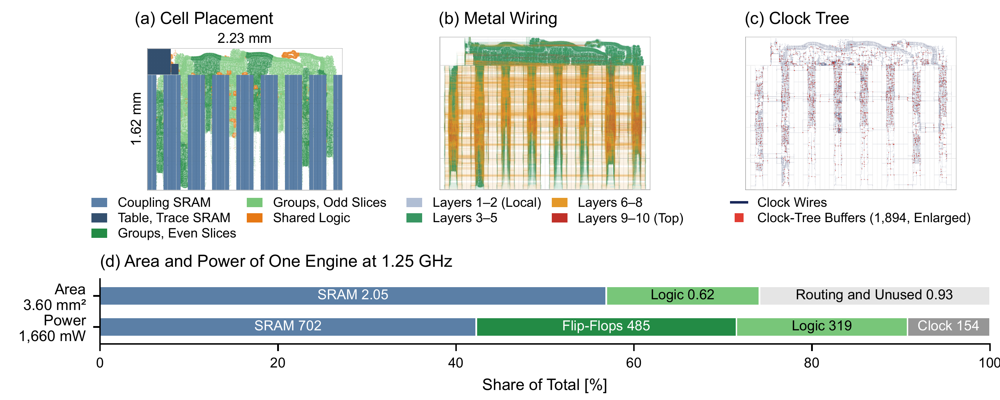

# Anechoic

Code and summary data for **"Anechoic: Onsager-Corrected Parallel Annealing for Sub-0.1 ms Dense Max-Cut on an FPGA"** by Seungki Hong (ETH Zurich), Kyeongwon Jeong (Yonsei University) and Taekwang Jang (ETH Zurich). The preprint link will be added here; the LaTeX source is in [`paper/`](paper/).

Stochastic cellular automata (SCA) update all spins of an Ising machine at once. This makes each spin's previous state return to it through its neighbours, an echo that undoes about two-thirds of all flips on K2000. Anechoic subtracts this echo from every decision. Dynamical mean-field theory gives the coefficient as the number of spins with a fractional flip probability, divided by twice the temperature. The engine counts it online (Onsager-online) or scales it with the temperature (Onsager-κT). This repository holds:
- the RTL engine for the AMD Alveo V80;
- the bit-exact GPU kernel;
- the RTL of the ASIC variant;
- the golden models;
- the theory and algorithm studies and the machine-checked proofs;
- the summary data behind the paper's tables and figures.

## Main results

- **FPGA.** On an AMD Alveo V80, twelve engines at 250 MHz reach a cut of at least 33,000 on K2000 with 99% probability in **0.05 ms**. That is 5.2× faster than the fastest published hardware, at 5.4 mJ per solution.
- **ASIC (simulation).** As a GlobalFoundries 22 nm ASIC routed at 1.25 GHz, twelve engines would reach the same target in about **10 µs**, 26× faster than the fastest published hardware.

### TTS99 on K2000 (Table 4 of the paper)

Time to reach the target cut with 99% probability. ta is the time of one anneal or round, and Pa its success probability. Values of other machines are quoted from the cited publications. **All CMOS and ReRAM results are simulations.**

| Machine | Hardware | Target cut | ta [ms] | Pa | TTS99 [ms] |
|---|---|---:|---:|---:|---:|
| Neal SA [[1]](#ref1) a | CPU | 33,000 | 4,610 | 0.38 | 44,413 |
| Neal SA [[1]](#ref1) a | CPU | 33,000 | 5,646 | 0.77 | 17,693 |
| CIM [[2]](#ref2) b | Optics | 33,000 | 5.0 | 0.02 | 1,139.74 |
| SB [[3]](#ref3) b | FPGA | 33,000 | 0.5 | 0.04 | 56.41 |
| STATICA [[4]](#ref4) c | CMOS | 33,000 | 0.13 | 0.07 | 8.23 |
| STATICA [[4]](#ref4) c | CMOS | 33,000 | 0.48 | 0.77 | 1.50 |
| bSB [[5]](#ref5) d | FPGA | 33,004 | – | – | 0.26 |
| ReAIM [[6]](#ref6) e | ReRAM | 33,000 | 0.15 | 0.47 | 1.11 |
| ReAIM [[6]](#ref6) e | ReRAM | 33,000 | 0.23 | 0.8 | 0.68 |
| GbSB [[7]](#ref7) f | FPGA | 33,337 | 9.42 | 0.989 | 9.61 |
| DSSA [[8]](#ref8) g | CMOS | n/s | 2.30 | 0.98 | 2.7 |
| **Anechoic** h | **FPGA** | **33,000** | **0.05** | **1.00** | **0.05** |
| **Anechoic** h | **GPU** | **33,000** | **0.11** | **1.00** | **0.11** |
| **Anechoic** h | **CMOS** | **33,000** | **0.01** | **1.00** | **0.01** |

a Simulated annealing on an Intel Core i9-12900KF, as reported by ReAIM.
b Compiled by STATICA. SB ran on an Intel Arria 10 GX FPGA.
c Cycle-level simulation of a 2K-spin STATICA at 300 MHz; the fabricated 65-nm chip has 512 spins.
d Time to target at 99% of the best-known cut (≥ 33,004); ta and Pa are not reported.
e Simulation of a ReRAM processing-in-memory design, with digital logic scaled from 130 to 32 nm.
f Intel Agilex 7 FPGA at 591 MHz. The target is the best-known cut; ta is 21,400 steps of 0.440 µs.
g Post-layout simulation of a 28-nm processor at 500 MHz, annealing phase only; target not stated (n/s).
h Onsager-κT, primary estimator. ta is the mean round time and Pa the fraction of successful rounds.
- FPGA: AMD Alveo V80, 12 engines at 250 MHz, 171 rounds.
- GPU: NVIDIA GH200, 120 chains with their own schedule, 128 rounds.
- CMOS: simulation of 12 GlobalFoundries 22FDX engines, routed at 1.25 GHz and cycle-exact to the FPGA in RTL.

### The same engine on three platforms (Table 5 of the paper)

K2000, target cut ≥ 33,000. The FPGA and GPU values are measured; the ASIC values are estimates. Each round starts one anneal on every engine or chain.
- The **primary** TTS99 treats a round as one run, so its Pa is the fraction of rounds in which at least one engine reaches the target.
- The **secondary** TTS99 treats every anneal as a run, with Pa = 1 − (1 − p)E, where p is the success probability of one anneal and E the number of engines or chains. It measures throughput.

The GPU uses 120 chains for the primary estimator and 240 for the secondary.

| | FPGA (AMD Alveo V80) | GPU (NVIDIA GH200) | ASIC (GlobalFoundries 22FDX, simulation) |
|---|---:|---:|---:|
| Engines or concurrent chains | 12 | 120–240 | 12 |
| Step latency, one chain [µs] | 0.15–0.18 | 0.63–0.72 | 0.031–0.035 |
| Primary TTS99 [ms] | 0.050 | 0.114 | 0.010 |
| Secondary TTS99 [ms] | 0.018 | 0.0078 | 0.0036 |
| Power [W] | 108 a | 382 | 19.9 b |
| Energy per solution [mJ] | 5.4 a | 43 | 0.20 b |
| Area [mm²] | – | – | 43 b |

a Board. The engines alone draw 39 W, which is 2.0 mJ per solution.
b Engines only.

### ASIC implementation (Figure 5 of the paper)

One engine (v6) in GlobalFoundries 22FDX, placed and routed at 1.25 GHz.
- **(a)** SRAM macros and standard cells by design hierarchy. Each of the eight slices holds four groups next to their coupling macros, so every coupling read stays within its slice.
- **(b)** Signal and clock wiring by metal layer.
- **(c)** Clock tree: 2,798 buffers and 756 clock gates drive about 162,000 flip-flops, with a mean insertion delay of 597 ps and a skew of 81 ps. Enlarged markers show the 1,894 buffers that clock-tree synthesis placed.
- **(d)** Area and power at the typical corner (0.80 V, 25 °C), with O1 activity.

### References for Table 4

1. D-Wave, dwave-neal, simulated-annealing sampler. https://github.com/dwavesystems/dwave-neal
2. T. Inagaki et al., Science, 2016. https://doi.org/10.1126/science.aah4243
3. H. Goto et al., Science Advances, 2019. https://doi.org/10.1126/sciadv.aav2372
4. K. Yamamoto et al., STATICA, IEEE Journal of Solid-State Circuits, 2021. https://doi.org/10.1109/JSSC.2020.3027702
5. H. Goto et al., Science Advances, 2021. https://doi.org/10.1126/sciadv.abe7953
6. H.-W. Chiang et al., ReAIM, ISCA, 2024. https://doi.org/10.1109/ISCA59077.2024.00015
7. H. Goto et al., Physical Review Applied, 2026. https://doi.org/10.1103/2qd9-x6v8
8. N. Onizawa et al., DSSA, IEEE Access, 2026. https://doi.org/10.1109/ACCESS.2026.3731035

## Layout

| Folder | Contents |
|---|---|
| `fpga/v80_sca/` | V80 engine. RTL in `src/v6/` (`sca_core*.v`); HLS kernels, host programs and golden models in `src/`; build, run and analysis scripts in `scripts/`. Also the frozen protocols (`PROTOCOL_HW*.md`), the design notes (`DESIGN.md`, `MULTIBIT_SPEC.md`) and the result summaries (`RESULTS_HW.md`, `RESULTS_MULTIBIT.md`, `results/`). |
| `gpu/onsager_v2_20261007/` | Bit-exact kernel for the NVIDIA GH200 (`src/sca_gpu.cu`), with protocol, report and result tables. |
| `gpu/multibit_bias_20261008/` | GPU kernel with multi-bit couplings and bias, with its G-set results. |
| `asic/gf22_engine_v64_1p25_20261007/` | ASIC variant of the v6 engine at 1.25 GHz. RTL in `rtl/`; source RTL and golden model in `orig/`; RTL regression in `sim/` and `scripts/`; derived 12-engine totals in `results/`. |
| `asic/gf22_engine_v64_20261007/` | The same, 1 GHz variant. |
| `asic/gf22_engine_v64_mb_20261008/` | Multi-bit ASIC variant (K = 2 and K = 4) with bias. |
| `research/dmft_sca_20261004/` | Dynamical mean-field theory of synchronous SCA. |
| `research/formal_verification_20261007/` | Lean 4/Mathlib (`SnowballFormal/`) and Rocq (`coq/`) proofs. |
| `research/algorithm_compare_20261007/`, `ablation_20261005/`, `theory_ideas_20261003/`, `iamp_evaluation_20261003/`, `statica_reproduction_20261003/`, `reaim_reproduction_20261003/` | The corrected update rules, the re-implemented baselines and their studies. |
| `research/fairness_audit_20261008/` | Comparison at the baselines' published settings (`k2000_pub/`), G-set speed-ups (`gset/`) and hardware tables (`hw_table2/`). |
| `research/v6_schedule_20261006/` | Schedule selection for the board configurations. |
| `research/gset_20261007/` | G-set study with the engine's model. |
| `research/reaim_benchmarks_20261008/` | Max-Cut, graph partitioning and TSP benchmarks in software. |
| `research/optimum_mitigation_20261007/` | Study at the best-known K2000 cut. |
| `paper/` | LaTeX source of the preprint. |
| `data/` | Download and verification of the benchmark instances. |

## Where the paper's results come from

| Paper | Source |
|---|---|
| Figure 1 (theory and simulation) | `research/dmft_sca_20261004/` (`dmft.py`, `dmft_torch.py`, `plot_theory_vs_sim_v2.py`) |
| Table 1 (machine-checked statements) | `research/formal_verification_20261007/` (`SPEC.md`) |
| Figure 2 (comparison at published settings) | `research/fairness_audit_20261008/k2000_pub/` (`run_pub.py`, `make_fig.py`, `pub_methods.py`), with the algorithm folders above |
| Stability predictions for the correction | `research/theory_ideas_20261003/` (`a2.py`, `PROTOCOL_A2.md`) |
| Figure 3 and the engine design | `fpga/v80_sca/src/v6/`, `fpga/v80_sca/DESIGN.md` |
| Tables 2 and 3 (board TTS99, design evolution) | `fpga/v80_sca/` (`RESULTS_HW.md`, `RESULTS_MULTIBIT.md`, `PROTOCOL_HW*.md`, `results/`) |
| Figure 4 (flips per step) | `research/algorithm_compare_20261007/flips_profile_v2.py` |
| Tables 4 and 5 (Anechoic on FPGA, GPU and ASIC) | `fpga/v80_sca/`, `gpu/onsager_v2_20261007/` (`REPORT.md`), `asic/gf22_engine_v64_1p25_20261007/results/` |
| Table 6 (FPGA resources) | `fpga/v80_sca/results/util_20261007/` |
| Table 7 and the ASIC results | `asic/` (RTL, regression, derived totals). The layout figure is in `paper/`. |
| Table 8 (G-set, measured) | `fpga/v80_sca/RESULTS_MULTIBIT.md` and `PROTOCOL_HW_MB_A3*`, `research/gset_20261007/`, `research/fairness_audit_20261008/gset/` |
| Table 9 (software benchmarks) | `research/reaim_benchmarks_20261008/` (`run_a5*.py`, `analyze_a5.py`, `compact_table*.md`) |
| Comparison with GbSB at the best-known cut | `research/optimum_mitigation_20261007/` |

## Requirements

- **Python 3.11 or newer** with numpy, numba, scipy and matplotlib. `dmft_torch.py` also needs PyTorch. The Neal reference runs need dimod and dwave-samplers. Exact versions are in the protocol files.
- **A C++17 compiler** for the golden models, the vector generators and the host programs.
- **For the GPU kernels:** CUDA 13 and an NVIDIA GH200 (sm_90).
- **For the V80 builds:** AMD Vivado/Vitis 2025.1, the [AVED](https://github.com/Xilinx/AVED) shell and an AMD Alveo V80.
- **For the RTL regressions:** a Verilog simulator (Siemens Questa or AMD Vivado xsim).
- **For the proofs:** Lean 4, at the version in `SnowballFormal/lean-toolchain`, with Mathlib; and the Rocq Prover 8.20.

Run `python3 data/fetch_data.py` once to obtain the benchmark instances; see [`data/README.md`](data/README.md).

## Notes

- **Placeholders.** The experiments ran on the authors' servers. For publication, user names, host names, local paths and device identifiers were replaced by placeholders: `/scratch/USER`, `gpu-host`, `fpga-host` and `GPU-xxxxxxxx-…`. Set them for your environment.
- **Hash records.** The SHA-256 records of the frozen protocols and inputs (`*.sha256`, `SHA256SUMS*.txt`) refer to the unredacted originals. The self-test in `research/fairness_audit_20261008/k2000_pub/pub_methods.py` checks the published files.
- **Raw data.** Per-trial records, spin states and traces are not included because of their size. The summaries, and the scripts that produced them, are included.
- **ASIC.** The ASIC folders contain the RTL, its regression against the golden model and the derived totals. Synthesis and place-and-route scripts and reports are not included, because they depend on a foundry design kit under a non-disclosure agreement.
- **FPGA platform.** The V80 builds use AMD's AVED shell, together with the platform-integration and programming scripts of the authors' earlier V80 design (`fpga/v80_snowball/`). Neither is part of this repository.

## Citation

The preprint entry will be added here.

## License

To be added.
