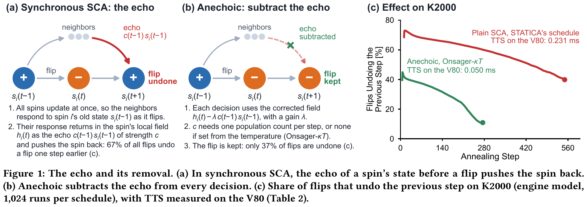
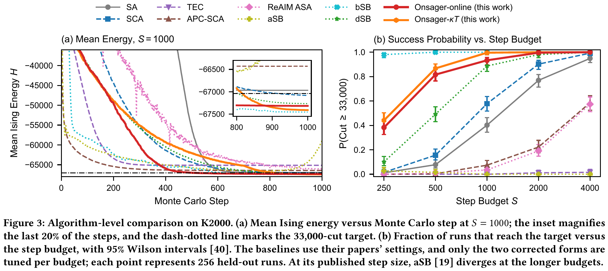
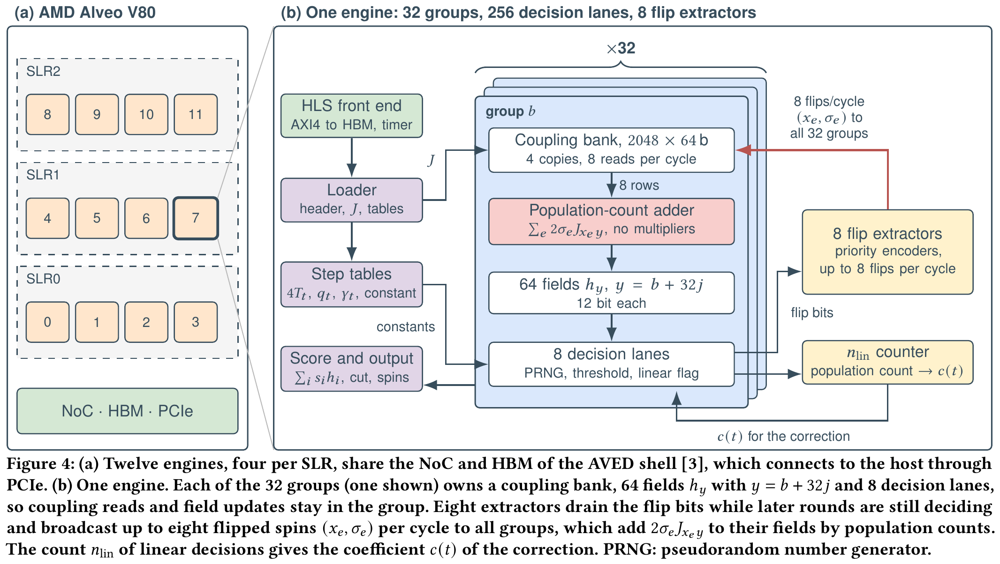
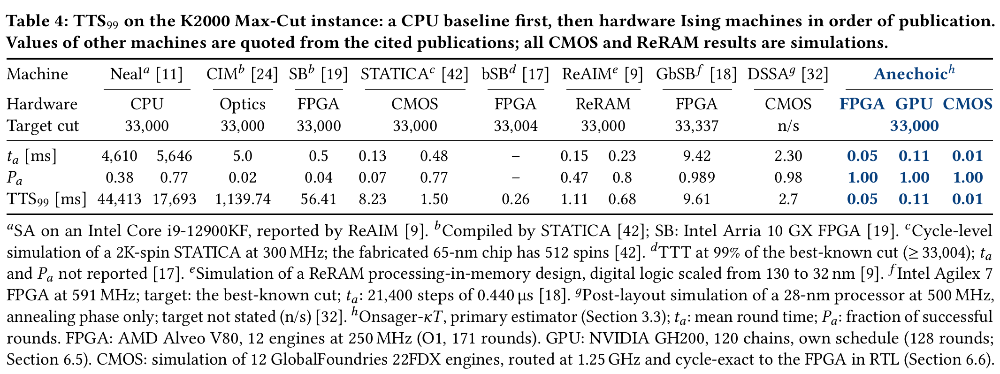
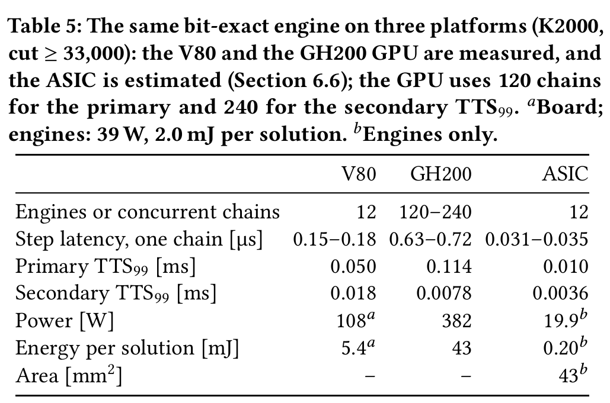
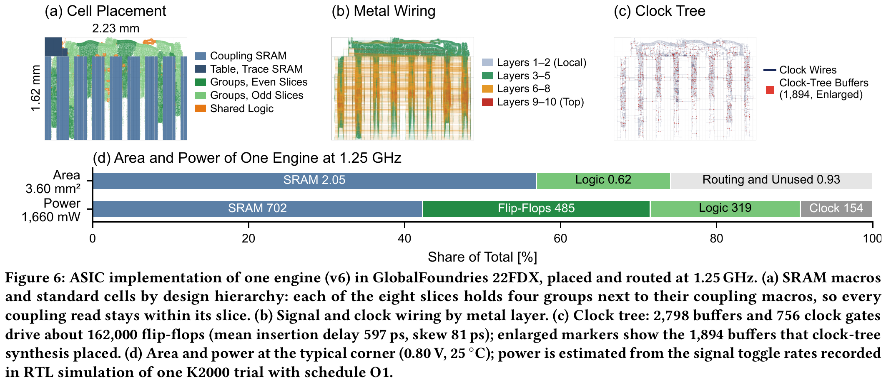

# Anechoic: Onsager-Corrected Parallel Annealing for Sub-0.1 ms Dense Max-Cut on an FPGA

This repository is the official implementation of the paper "Anechoic: Onsager-Corrected Parallel Annealing for Sub-0.1 ms Dense Max-Cut on an FPGA".

By Seungki Hong, Kyeongwon Jeong and Taekwang Jang.

> **Abstract:** Ising machines solve combinatorial optimization problems by annealing a network of spins. On dense problems, where every spin couples to every other, the least expensive hardware step updates all spins at once: stochastic cellular automata (SCA) decide every spin in parallel and read couplings only for the spins that flip. Such synchronous updates, however, *create an echo: the previous state of each spin returns to it through its neighbors*. On K2000, the Max-Cut benchmark on a complete graph of 2,000 nodes, two-thirds of all flips undo a flip that the same spin made one step earlier. This paper presents *Anechoic*, an FPGA Ising machine that *subtracts this echo from every decision*. Dynamical mean-field theory identifies the echo as an Onsager reaction and gives the strength of its one-step part: *the number of spins whose flip probability lies strictly between 0 and 1, divided by twice the temperature*. The decision logic already flags these spins, so this Onsager correction costs one population count per step, and a temperature-scaled approximation needs no count. A hand-written RTL engine executes a dense 2,000-spin step in 18.1 cycles plus 0.14 cycles per flip, so every step and flip that the correction saves is saved time. In experiments, the counted and the temperature-scaled correction both find better K2000 cuts at every step budget than each of five published binary-spin algorithms run at its paper's settings. Twelve engines at 250 MHz on an AMD Alveo V80 reach a cut of at least 33,000 on K2000 with 99% probability in **0.05 ms, 5.2× faster than the fastest published hardware**, at 5.4 mJ per solution; with 2-bit couplings, the temperature-scaled form is also faster than uncorrected SCA on 48 of 51 sparse G-set graphs. On an NVIDIA GH200 GPU, the identical engine is 2.3× slower and needs 8.0× more energy per solution, though its 240 concurrent anneals give 2.3× higher throughput. As a GlobalFoundries 22 nm ASIC routed at 1.25 GHz (typical corner), twelve engines would reach the target in about **10 µs, 26× faster than the fastest published hardware**, with 0.20 mJ of engine energy per solution.
>
> 
>
> <br>
>
> 
>
> <br>
>
> 
>
> <br>
>
> 
>
> <br>
>
> 
>
> <br>
>
> 
>
> <sub>Figures 1, 3, 4 and 6 and Tables 4 and 5 of the paper. Bracketed numbers are the paper's references.</sub>

## Contents
1. [Environment](#environment)
1. [Data](#data)
1. [Repository structure](#repository-structure)
1. [Paper results and their code](#paper-results-and-their-code)
1. [Notes](#notes)
1. [Citation](#citation)

## Environment
- **Python 3.12** with numpy, numba, scipy and matplotlib. `dmft_torch.py` also needs PyTorch. The Neal reference runs need dimod and dwave-samplers. Exact versions are in the protocol files.
- **A C++17 compiler** for the golden models, the vector generators and the host programs.
- **For the GPU kernels:** CUDA 13.3 and an NVIDIA GH200 (sm_90).
- **For the V80 builds:** AMD Vivado/Vitis 2025.1, the [AVED](https://github.com/Xilinx/AVED) shell and an AMD Alveo V80.
- **For the RTL regressions:** a Verilog simulator (Siemens Questa or AMD Vivado xsim).
- **For the proofs:** Lean 4 (v4.35.0-rc4, as pinned in `SnowballFormal/lean-toolchain`) with Mathlib, and the Rocq Prover 9.3.

## Data
```bash
git clone https://github.com/skethz/anechoic.git
cd anechoic
python3 data/fetch_data.py
```
`fetch_data.py` downloads K2000, the G-set and the TSPLIB instances from their original sources. It checks every file against the SHA-256 recorded in the experiments and places it where the scripts expect it; see [`data/README.md`](data/README.md).

## Repository structure
The repository holds the RTL engine for the AMD Alveo V80, the bit-exact GPU kernel, the RTL of the ASIC variant, the golden models, the theory and algorithm studies, the machine-checked proofs, and the summary data behind the paper's tables and figures.

| Folder | Contents |
|---|---|
| `fpga/v80_sca/` | V80 engine. RTL in `src/v6/` (`sca_core*.v`); HLS kernels, host programs and golden models in `src/`; build, run and analysis scripts in `scripts/`. Also the frozen protocols (`PROTOCOL_HW*.md`), the design notes (`DESIGN.md`, `MULTIBIT_SPEC.md`) and the result summaries (`RESULTS_HW.md`, `RESULTS_MULTIBIT.md`, `results/`). |
| `gpu/onsager_v2_20261007/` | Bit-exact kernel for the NVIDIA GH200 (`src/sca_gpu.cu`), with protocol, report and result tables. |
| `gpu/multibit_bias_20261008/` | GPU kernel with multi-bit couplings and bias, with its G-set results. |
| `asic/gf22_engine_v64_1p25_20261007/` | ASIC variant of the v6 engine at 1.25 GHz. RTL in `rtl/`; source RTL and golden model in `orig/`; RTL regression in `sim/` and `scripts/`; derived 12-engine totals in `results/`. |
| `asic/gf22_engine_v64_20261007/` | The same, 1 GHz variant. |
| `asic/gf22_engine_v64_mb_20261008/` | Multi-bit ASIC variant (K = 2 and K = 4) with bias. |
| `research/dmft_sca_20261004/` | Dynamical mean-field theory of synchronous SCA. |
| `research/headline_echo_20261009/` | Echo statistics and plot of Figure 1. |
| `research/formal_verification_20261007/` | Lean 4/Mathlib (`SnowballFormal/`) and Rocq (`coq/`) proofs. |
| `research/algorithm_compare_20261007/`, `ablation_20261005/`, `theory_ideas_20261003/`, `iamp_evaluation_20261003/`, `statica_reproduction_20261003/`, `reaim_reproduction_20261003/` | The corrected update rules, the re-implemented baselines and their studies. |
| `research/fairness_audit_20261008/` | Comparison at the baselines' published settings (`k2000_pub/`), G-set speed-ups (`gset/`) and hardware tables (`hw_table2/`). |
| `research/v6_schedule_20261006/` | Schedule selection for the board configurations. |
| `research/gset_20261007/` | G-set study with the engine's model. |
| `research/reaim_benchmarks_20261008/` | Max-Cut, graph partitioning and TSP benchmarks in software. |
| `research/optimum_mitigation_20261007/` | Study at the best-known K2000 cut. |
| `paper/` | LaTeX source of the preprint. |
| `data/` | Download and verification of the benchmark instances. |

## Paper results and their code
| Paper | Source |
|---|---|
| Figure 1 (the echo and its removal) | `research/headline_echo_20261009/` (`echo_stats.py`, `plot_headline.py`) |
| Figure 2 (theory and simulation) | `research/dmft_sca_20261004/` (`dmft.py`, `dmft_torch.py`, `plot_theory_vs_sim_v2.py`) |
| Table 1 (machine-checked statements) | `research/formal_verification_20261007/` (`SPEC.md`) |
| Figure 3 (comparison at published settings) | `research/fairness_audit_20261008/k2000_pub/` (`run_pub.py`, `make_fig.py`, `pub_methods.py`), with the algorithm folders above |
| Stability predictions for the correction | `research/theory_ideas_20261003/` (`a2.py`, `PROTOCOL_A2.md`) |
| Figure 4 and the engine design | `fpga/v80_sca/src/v6/`, `fpga/v80_sca/DESIGN.md` |
| Tables 2 and 3 (board TTS99, design evolution) | `fpga/v80_sca/` (`RESULTS_HW.md`, `RESULTS_MULTIBIT.md`, `PROTOCOL_HW*.md`, `results/`) |
| Figure 5 (flips per step) | `research/algorithm_compare_20261007/flips_profile_v2c.py` |
| Tables 4 and 5 (Anechoic on FPGA, GPU and ASIC) | `fpga/v80_sca/`, `gpu/onsager_v2_20261007/` (`REPORT.md`), `asic/gf22_engine_v64_1p25_20261007/results/` |
| Table 6 (FPGA resources) | `fpga/v80_sca/RESULTS_HW.md` (final v6.4 section) |
| Figure 6, Table 7 and the ASIC results | `asic/` (RTL, regression, derived totals). The layout figure is `docs/figure6.png`. |
| Table 8 (G-set, measured) | `fpga/v80_sca/RESULTS_MULTIBIT.md` and `PROTOCOL_HW_MB_A3*`, `research/gset_20261007/`, `research/fairness_audit_20261008/gset/` |
| Table 9 (software benchmarks) | `research/reaim_benchmarks_20261008/` (`run_a5*.py`, `analyze_a5.py`, `table8b_a5.md`) |
| Comparison with GbSB at the best-known cut | `research/optimum_mitigation_20261007/` |

## Notes
- **Placeholders.** The experiments ran on the authors' servers. For publication, user names, host names, local paths and device identifiers were replaced by placeholders: `/scratch/USER`, `gpu-host`, `fpga-host` and `GPU-xxxxxxxx-…`. Set them for your environment.
- **Hash records.** The SHA-256 records of the frozen protocols and inputs (`*.sha256`, `SHA256SUMS*.txt`) refer to the unredacted originals. The self-test in `research/fairness_audit_20261008/k2000_pub/pub_methods.py` checks the published files.
- **Protocol gates.** The V80 bring-up and run scripts (`fpga/v80_sca/scripts/bringup_*.sh`, `run_hw_v6_a5.sh`) stop unless the frozen protocol files match their records. In this release that check fails, because paths were replaced and some inputs are not included. Regenerate the records for your setup, or remove the check.
- **Superseded documents.** Some reports in the study folders were written before the final measurements. Each carries a dated note at the top that gives the final values and their source.
- **Raw data.** Per-trial records, spin states and traces are not included because of their size. The summaries, and the scripts that produced them, are included.
- **ASIC.** The ASIC folders contain the RTL, its regression against the golden model and the derived totals. Synthesis and place-and-route scripts and reports are not included, because they depend on a foundry design kit under a non-disclosure agreement.
- **FPGA platform.** The V80 builds use AMD's AVED shell, together with the platform-integration and programming scripts of the authors' earlier V80 design (`fpga/v80_snowball/`). Neither is part of this repository.

## Citation
```bibtex
@misc{hong2026anechoic,
      title={{Anechoic: Onsager-Corrected Parallel Annealing for Sub-0.1 ms Dense Max-Cut on an FPGA}},
      author={Seungki Hong and Kyeongwon Jeong and Taekwang Jang},
      year={2026},
      url={https://github.com/skethz/anechoic},
}
```
